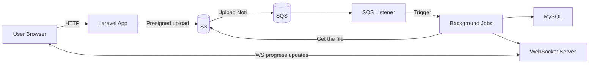
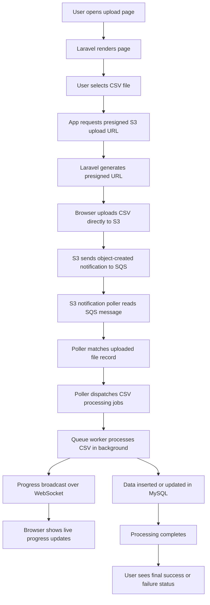

# CSV Upload

Laravel 10 application for CSV upload and processing with queued background jobs, Redis-backed real-time progress updates, and a local Docker workflow.

## Stack

- PHP 8.3
- Laravel 10
- MySQL 8
- Redis 7
- Laravel Horizon
- Laravel WebSockets
- Vite / npm

## What It Does

- Upload CSV files from the web UI
- Process imports asynchronously through Laravel queues
- Broadcast import progress over WebSockets
- Update existing records from follow-up CSV uploads
- Mark failed imports when the input file is invalid

## System Architecture Diagram



## User Workflow Diagram



## Prerequisites

For local non-Docker development:

- PHP 8.3
- Composer 2
- Node.js 20 and npm
- MySQL 8
- Redis

For containerized development, Docker Desktop with Compose is enough.

## Quick Start With Docker

```bash
cp .env.docker .env
docker compose up -d --build
docker compose exec laravel composer install
docker compose exec laravel npm install
docker compose exec laravel php artisan key:generate
docker compose exec laravel php artisan migrate
```

Open the app at `http://localhost:8000`.

Useful ports:

- `8000` Laravel app
- `6001` WebSocket server
- `3307` MySQL
- `6380` Redis

More Docker detail lives in [DOCKER.md](/Users/tharhtoo/Herd/csv-upload/DOCKER.md) and [DOCKER-EXPLAINED.md](/Users/tharhtoo/Herd/csv-upload/DOCKER-EXPLAINED.md).

## Local Setup Without Docker

```bash
composer install
npm install
cp .env.example .env
php artisan key:generate
php artisan migrate
```

Run the app and supporting processes in separate terminals:

```bash
php artisan serve
php artisan queue:work
php artisan websockets:serve
npm run dev
```

If you use Horizon locally, run:

```bash
php artisan horizon
```

## Environment Notes

Core values used by this project:

```env
DB_CONNECTION=mysql
DB_HOST=mysql
DB_PORT=3306
REDIS_HOST=redis
REDIS_PORT=6379
QUEUE_CONNECTION=redis
BROADCAST_DRIVER=pusher
PUSHER_HOST=127.0.0.1
PUSHER_PORT=6001
PUSHER_SCHEME=http
```

Inside Docker containers, use Compose service names such as `mysql` and `redis`. From the browser, connect to the WebSocket host exposed on your machine.

## AWS S3 And SQS Setup

This project supports direct CSV uploads to AWS S3 and background processing triggered from S3 upload notifications delivered through Amazon SQS.

Set these environment variables when using AWS storage:

```env
FILESYSTEM_DISK=s3
AWS_ACCESS_KEY_ID=
AWS_SECRET_ACCESS_KEY=
AWS_DEFAULT_REGION=ap-southeast-1
AWS_BUCKET=
AWS_UPLOAD_PREFIX=csv-uploads
AWS_PRESIGN_TTL_MINUTES=10
AWS_S3_UPLOAD_NOTIFICATION_QUEUE_URL=
AWS_USE_PATH_STYLE_ENDPOINT=false
AWS_ENDPOINT=
AWS_URL=
```

What each setting is used for:

- `FILESYSTEM_DISK=s3` stores uploaded files on the S3 disk instead of local storage.
- `AWS_BUCKET` is the bucket used for uploaded CSV files.
- `AWS_UPLOAD_PREFIX` is the folder prefix used when generating upload paths.
- `AWS_PRESIGN_TTL_MINUTES` controls how long presigned upload URLs stay valid.
- `AWS_S3_UPLOAD_NOTIFICATION_QUEUE_URL` points to the SQS queue consumed by `php artisan s3:poll-upload-notifications`.
- `AWS_ENDPOINT` and `AWS_USE_PATH_STYLE_ENDPOINT=true` are useful for S3-compatible local services such as LocalStack or MinIO.

Expected AWS wiring:

1. The app generates a presigned upload target for S3.
2. The client uploads the CSV to S3.
3. The S3 bucket sends object-created notifications to an SQS queue.
4. The app polls that queue and starts CSV processing for matching uploaded files.

The queue poller can be run manually outside Docker:

```bash
php artisan s3:poll-upload-notifications
```

Inside Docker it is already started by Supervisor in the `laravel` container.

If you want Laravel's queue driver itself to use Amazon SQS instead of Redis, Laravel's standard queue settings are also available in `config/queue.php`:

```env
QUEUE_CONNECTION=sqs
SQS_PREFIX=https://sqs.<region>.amazonaws.com/<account-id>
SQS_QUEUE=default
SQS_SUFFIX=
AWS_DEFAULT_REGION=ap-southeast-1
AWS_ACCESS_KEY_ID=
AWS_SECRET_ACCESS_KEY=
```

That is separate from `AWS_S3_UPLOAD_NOTIFICATION_QUEUE_URL`. In the current Docker-oriented setup, the app queue driver defaults to Redis while S3 upload notifications are polled from SQS.

## Common Commands

```bash
# Tests
php artisan test
php artisan test --testsuite=Feature
php artisan test --testsuite=Unit

# Code style
./vendor/bin/pint
./vendor/bin/pint --test

# Cache and config
php artisan optimize:clear
php artisan config:clear
php artisan cache:clear

# Queue worker reload after job changes
php artisan queue:restart
```

Docker equivalents:

```bash
docker compose exec laravel php artisan test
docker compose exec laravel ./vendor/bin/pint
docker compose exec laravel php artisan optimize:clear
```

## Sample CSV Flow

Test files referenced by the original project documentation:

- `yoprint_test_import.csv`
- `yoprint_test_updated.csv`
- `yoprint_test_import_1m.csv`
- `yoprint_test_import - Failed.csv`

Typical flow:

1. Upload `yoprint_test_import.csv` to create records.
2. Upload `yoprint_test_updated.csv` to update existing records by unique keys.
3. Upload `yoprint_test_import - Failed.csv` to verify failure handling.
4. Upload `yoprint_test_import_1m.csv` only in a controlled environment if you want to test large imports.

Queue workers and the WebSocket server must be running or you will not see background progress updates.

## Docker Image Notes

The app image is defined in [docker/8.3/Dockerfile](/Users/tharhtoo/Herd/csv-upload/docker/8.3/Dockerfile). It currently installs a focused local development toolset:

- PHP 8.3 CLI
- Composer
- Node.js and npm
- MySQL client
- Supervisor
- PHP extensions used by this app, including MySQL, Redis, XML, ZIP, BCMath, Intl, MBString, Curl, Readline, PCNTL, and POSIX

Unused extras such as PostgreSQL tooling, SQLite tooling, GD, Imagick, Xdebug, Yarn, pnpm, and Bun are intentionally excluded.

## Project Structure

```text
app/
database/
resources/
routes/
tests/
docker/
```

## License

This project is open-sourced software licensed under the [MIT license](https://opensource.org/licenses/MIT).
